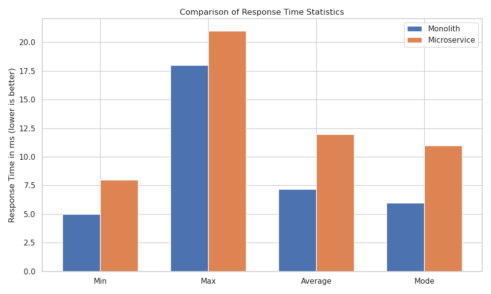
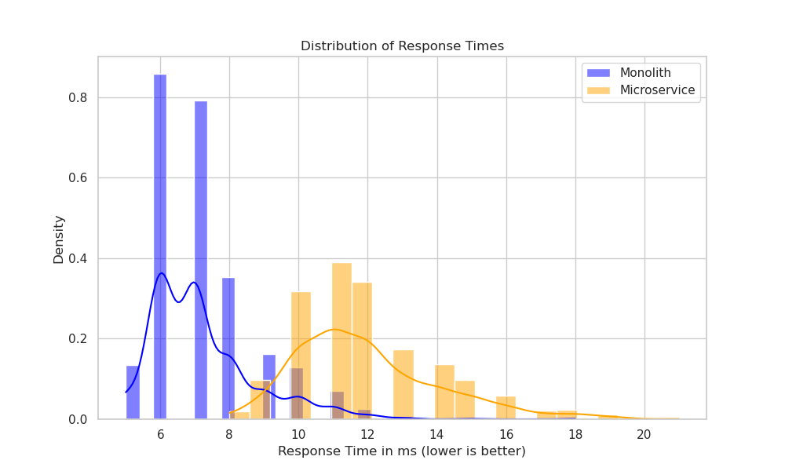
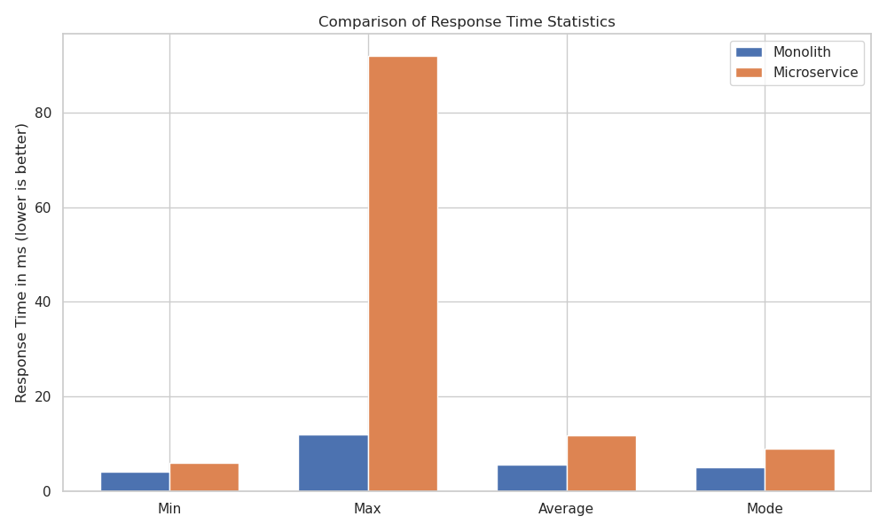

# Clubs++@IIITH - Microservice Architecture Branch

This branch contains an experimental version of the **Clubs++@IIITH** Recruitment Management System, specifically designed to analyze and compare a microservice architecture against the primary monolithic design.

## Overview of the Architectural Experiment

The main application in the `main` branch is a modular monolith. In this `microservices` branch, the **AI-powered recommendation engine** has been extracted into its own separate, containerized microservice.

The purpose of this branch is to provide a practical, hands-on comparison of the two architectural patterns for our specific use case. We evaluated both designs on qualitative metrics (development speed, operational complexity) and quantitative performance metrics (response time, latency).

---

## Architectural Analysis: Monolith vs. Microservice

Based on our implementation and testing, we drew the following conclusions, as detailed in our project report.

### Qualitative Comparison

| Aspect                        | Monolithic Architecture (in `main` branch)                                  | Microservice Architecture (in this branch)                                                              |
| ----------------------------- | --------------------------------------------------------------------------- | ------------------------------------------------------------------------------------------------------- |
| **Development Velocity**      | **Faster.** Direct function calls, single codebase, and unified testing accelerate development. | **Slower.** Increased overhead from managing separate deployments, API versioning, and inter-service communication. |
| **Performance & Latency**     | **Higher.** Intra-process calls have minimal latency, crucial for user-facing workflows. | **Lower.** Inherent network latency is introduced for every call to the recommendation service. |
| **Operational Complexity**    | **Simpler.** Centralized monitoring, logging, and debugging within a single container. | **More Complex.** Requires separate monitoring, distributed tracing, and managing more potential points of failure. |
| **Data Consistency**          | **Stronger.** Easily managed with shared database transactions.             | **Weaker.** Requires complex patterns (e.g., distributed transactions) if core features were split. |

### Quantitative Comparison (Performance Benchmark)

We benchmarked the response time for fetching club recommendations. To ensure a fair comparison, the non-deterministic Gemini API call was replaced with a simple, deterministic function in both architectures.

#### Standard Test (1,000 Runs)

The initial test was conducted with **1,000 requests** to compare the typical performance characteristics of both systems.

**Statistical Summary (1,000 Runs)**
The bar chart below shows a clear performance advantage for the monolith across all statistical measures.



**Response Time Distribution (1,000 Runs)**
The density plot visualizes the consistency of each architecture. The monolith's response times are tightly clustered at a lower value, while the microservice exhibits a much wider and slower distribution, indicating higher latency and less predictable performance.



#### Extended Test (10,000 Runs)

To analyze performance under a more sustained load and capture outlier behavior, we conducted an extended test with **10,000 requests**. This test dramatically highlighted the microservice's latency and inconsistency issues.

**Statistical Summary (10,000 Runs)**
As shown below, the maximum response time for the microservice architecture spiked to over **80ms**, a behavior not observed in the monolith, reinforcing the conclusion that network overhead becomes a significant bottleneck under load.



### Conclusion

For the tightly-coupled domain of our recruitment system, the **monolithic architecture provides the best balance of performance, development velocity, and operational simplicity.** While a microservice approach is valuable for isolated, computationally distinct functions, the overheads—especially in terms of performance and consistency—outweighed the benefits for our core workflows.

This branch serves as the practical proof and implementation for this analysis.

---

## How to Run

This setup assumes the recommendation microservice is defined as a separate service within the `docker-compose.yml` file for this branch.

```bash
# Build and run all services (main backend + recommendation microservice)
docker compose up --build
